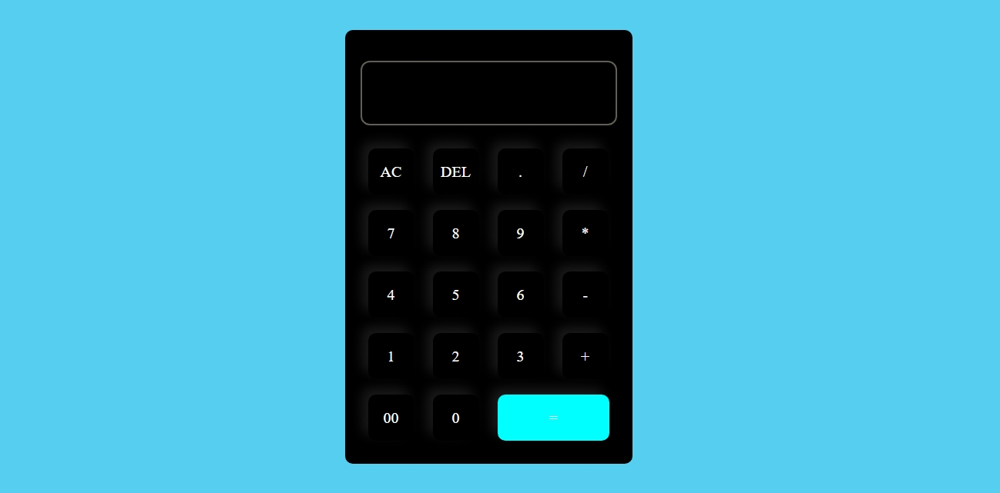
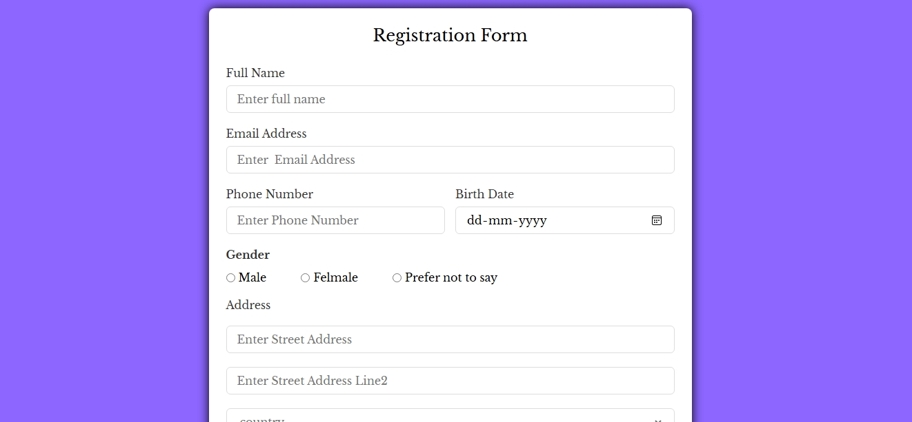

# 🌟 CSS Basics Projects

> **💻 Hands-on HTML + CSS practice to master the core building blocks of web design!**

Welcome to my **CSS Basics Projects** repository — a curated collection of simple yet effective mini-projects built to learn and reinforce CSS concepts from scratch. These are great for absolute beginners or anyone revisiting the foundations.

---

## 🔍 What’s Inside?

Each project focuses on **one or more core CSS topics**, including layout, display, positioning, and responsiveness.

| 📁 Project Name | 🧠 Concepts Covered |
|----------------|----------------------|
| `01 - Calculator ` | `box-model`, `display`, `padding`, `border`, `hover effects` |
| `02 - Registration Form` | `form layout`, `input styling`, `labels`, `button design`, `margin/padding` |

> 📦 Each folder includes:
> - HTML + CSS source code
> - Preview screenshots

---

## 🎯 Why This Repo?

✨ To **learn by doing**.  
✨ To **understand each CSS concept visually**.  
✨ To **create real-world layouts from day one**.  

This is **not just theory** — every project here is built from scratch, helping you connect **what you learn** with **what you create**.

---

## 🛠️ Tech Stack

- 🧱 HTML5
- 🎨 CSS3
- ⚙️ Visual Studio Code
- 🌐 Live Server
- 🧪 Chrome DevTools

---

## 📸 Project Previews

Here’s a quick look at some of the projects:

### 🧑‍💻 Calculator

### 📱 Responsive  RegistrationForm

---

## 🧠 Learning Goals

- ✅ Master the Box Model
- ✅ Practice `display` & `position`
- ✅ Learn Flexbox deeply
- ✅ Build a responsive layout with media queries
- ⏳ Explore CSS Grid
- ⏳ Add animations and transitions

---

## 🌈 Upcoming Projects

- [ ] Responsive Portfolio Website
- [1] CSS Grid Layout project
- [2] Animated Button Effects
- [3] CSS-only Navbar

---

## 🤝 Let’s Connect!

If you’re also on a frontend journey, let’s grow together 🚀

- 💌 ashivu656@gmail.com

Drop a ⭐ if you find this helpful!

---

## 📝 License

 
Feel free to clone, fork, and learn — just give credit 💖

---
